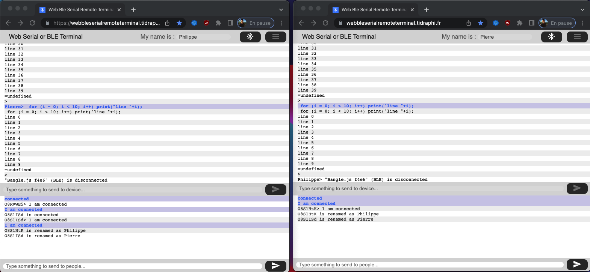

# WebBleSerialRemoteTerminal

Here I combine in an nodeJs web app the power of the BLE/Serial Web API and the principle of HTTP sockets to allow an embedded systems administrator to help a user maintain their device remotely.

## Web app usage

- using the "Google Chrome" browser on a computer or the "WebBLE" app on iOS smartphone, several users can load the sape page : <https://localhost:3000/>
- they can set their name and chat with all others
- one user can connect to its BLE or Serial device (Exomo Copilot, HM-10 BLE devices, Espruino, PuckJS, Bangle.js)
- all users can see who is connected to a device, can write text to it and read the its response
- all texts are log in a JSON format on the console and in server-logs/app.log file
- all HTTP access are log in server-logs/access.log file

## Sources of inspiration & resources

This is a mix of the following resources :

- First tutorial about sockets : <https://socket.io/get-started/chat>
- Web Bluetooth Terminal from Danila Loginov : <https://github.com/loginov-rocks/Web-Bluetooth-Terminal> and <https://github.com/loginov-rocks/bluetooth-terminal>
- Web Bluetooth API : <https://webbluetoothcg.github.io/web-bluetooth/>
- Web Serial API : <https://web.dev/serial/>
- Espruino Quick Start (Bluetooth LE) : <https://www.espruino.com/Quick+Start+BLE>
- Espruino Web IDE : <https://www.espruino.com/ide/>
- Serial Terminal : <https://googlechromelabs.github.io/serial-terminal/>

## TODO
 - inject logs in a MongoDB database for further analysis 

 ## On a production docker server

 ### Start

        docker-compose -f docker-compose-server.yml up -d

### Clean, recreate and restart in a production docker server
        docker stop webbleserialremoteterminal_server-app_1 \
        && docker rm webbleserialremoteterminal_server-app_1  \
        && docker image rm webbleserialremoteterminal_server-app:latest \
        && docker volume rm webbleserialremoteterminal_pgdata \
        && docker-compose -f docker-compose-server.yml up -d

## Developer's notes

### Docker and Development Environments on MacOS

- Setting up for Node.js on MacOS : <https://www.activelamp.com/blog/devops/docker-and-development-environments-setting-up-for-nodejs-on-osx>

### Create and use a self signed certificat

The final URL must use HTTPS protocol for the WEB BLE/Serial API to work.
To do that, you can serve this web app behind a proxy serving the result with HTTPS or enable it directly in the app.

To enable https in this node.js app :

- edit server-app/server.js and uncomment this line

        // const httpModule = 'https';

- create a self signed certificate

        cd server-app

        openssl genrsa -out server.key
        openssl req -new -key server.key -out csr.pem
        openssl x509 \
               -req \
               -days 9999 \
               -in csr.pem \
               -signkey server.key \
               -out server.cer
        rm csr.pem

### Start the server

        docker-sync-stack start

or

        docker-sync start \
        && docker-compose up

### Stop and clean the server

        Ctrl+C
        docker-sync-stack clean \
        && docker image rm webbleserialremoteterminal_server-app

or

        Ctrl+C
        docker-sync clean \
        && docker-compose down \
        && docker image rm webbleserialremoteterminal_server-app

### Stop, clean and restart the server

        Ctrl+C
        docker-sync-stack clean \
        && docker image rm webbleserialremoteterminal_server-app \
        && docker-sync-stack start
